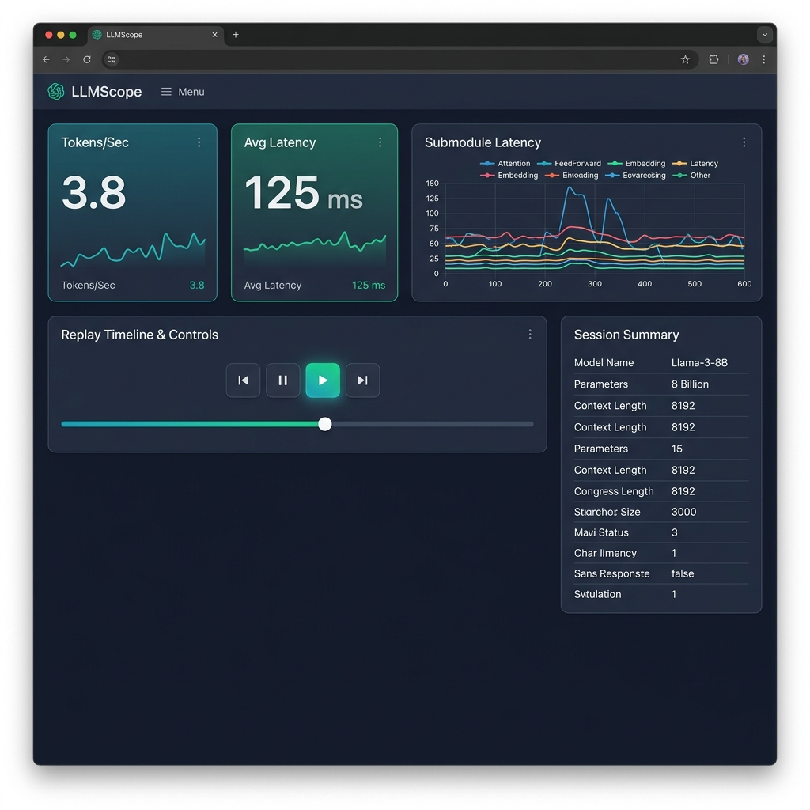
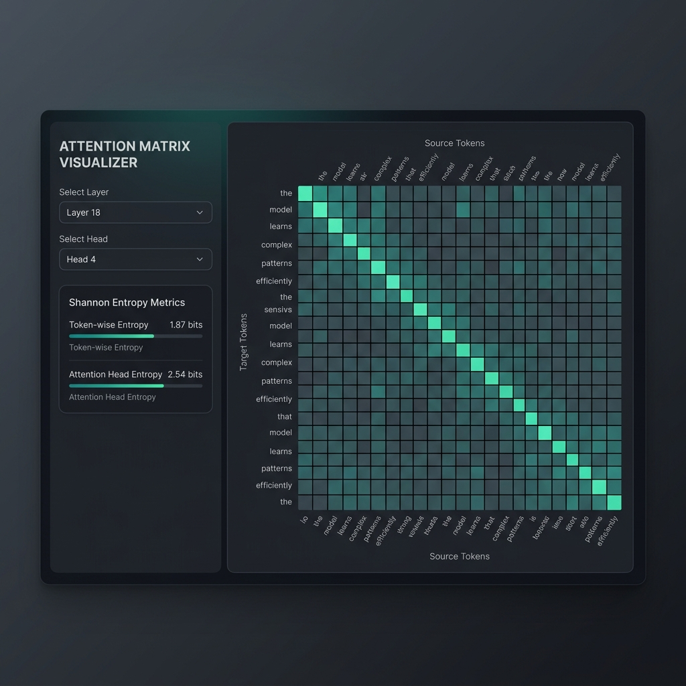
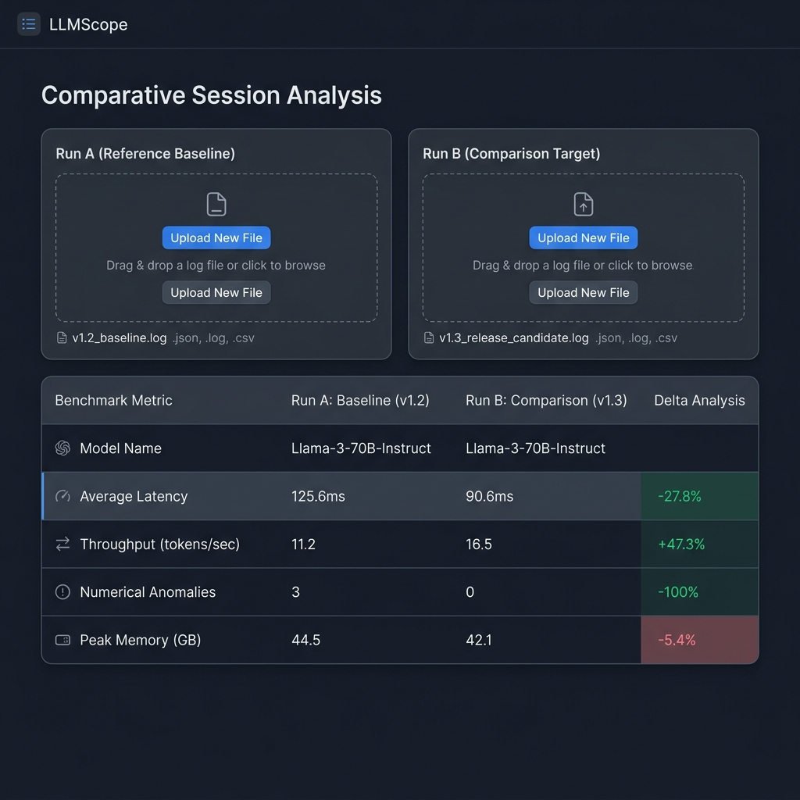

# LLMScope: Local LLM Instrumentation & Teleplay Observability Platform

LLMScope is a lightweight, non-invasive telemetry and diagnostic platform designed to trace, profile, and audit local transformer-based models in real-time. It exposes activations, latencies, numerical anomalies, and attention weight heatmaps through a high-performance C++ backend and a responsive Web Dashboard.

## Key Features

1. **Live Attention Heatmap Visualizer**: Supports matrix grids showing local banded diagonal attention (Head 0), long-range cross-attention (Head 1), and dense global token attention (Head 2) with real-time Shannon Entropy audits.
2. **Comparative Session Analysis (Benchmarking)**: Upload saved telemetry sessions side-by-side or compare against the current run to analyze latency shifts, throughput (tok/sec), anomalies, and peak memory delta changes.
3. **Session Export & Saving**: Direct action controls to download session JSON telemetry files, export metrics as CSV tables, or trigger C++ server-side persistent saves.
4. **Collapsible Model Topology Explorer**: Interactive, expandable tree showing model modules (embeddings, layers, norms, lm_heads) and highlighting their corresponding telemetry channels.
5. **Numerical Anomaly Ledger**: Tracks NaN/Inf injections, dead layers (zero-variance activations), exploding activations, and CPU fallbacks.
6. **Real PyTorch & HuggingFace Hooks**: Tracing module capturing attention outputs dynamically on live GPT-2, Llama, or Mistral models.

---

## Screenshots

### 1. Dashboard Overview


### 2. Attention Matrix Heatmap


### 3. Benchmarking & Comparative Run Analysis


---

## Architecture & Technology Stack

- **Backend**: C++17 (C++20 compliant) native winsock networking engine, multi-threaded event bus, and RingBuffer storage.
- **Web Server**: Built-in C++ HTTP server serving a single-page reactive dashboard page and Web APIs.
- **Python Integration**: PyTorch pre- and post-forward hooks for non-invasive model capture.

---

## Build & Execution Instructions

### 1. Build C++ Web Telemetry Server (Windows MinGW)
```powershell
cmake -B build -G "MinGW Makefiles" -DCMAKE_BUILD_TYPE=Release
python -m cmake --build build --target llmscope_web --config Release
```

### 2. Start the Server
```powershell
./build/llmscope_web.exe --web
```
Access the dashboard UI at: `http://localhost:8080`

### 3. Run the PyTorch Hugging Face Telemetry Demo
```powershell
python examples/run_hf_model.py --model sshleifer/tiny-gpt2 --steps 15
```
This loads a real GPT-2 transformer, attaches the non-invasive telemetry hooks, performs token-by-token text generation, and streams live metrics to the dashboard on port 5005.

### 4. Run Telemetry Simulator
```powershell
./build/llmscope_web.exe --web --sim
```
This feeds mock tokens and simulated attention matrix behaviors for Llama-3-8B directly to the dashboard.
